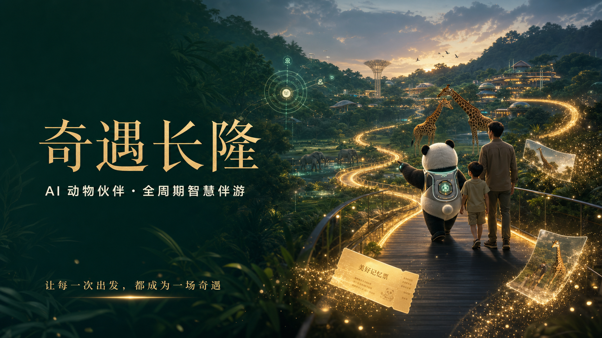

# 奇遇长隆 · 全周期 AI 智慧伴游



面向主题乐园场景的全周期 AI 智慧伴游概念方案。项目以可持续陪伴的动物 Agent 为核心，将游前个性化规划、游中动态导览与空间触发互动、游后 AIGC 回忆内容生成连接为完整体验，并探索餐饮、零售、酒店与内容传播等多业态协同。

> 本项目为参赛概念原型，与长隆集团无官方隶属关系。相关名称、商标与品牌资产归各自权利人所有。

## 核心体验

- 游前：通过对话理解同行成员、兴趣、体力、饮食与时间约束，生成个性化路线。
- 游中：结合位置、排队、天气和临时需求动态调整计划，并在动物区域唤醒专属 Agent。
- 游后：整合游览轨迹、互动与用户授权素材，生成旅行回顾、电子纪念册和短片。
- 商业协同：以体验节点自然连接餐饮、零售、酒店和定制纪念品，而非生硬广告。

## 仓库内容

- `qiyu-remotion-video/`：基于 React 与 Remotion 的宣传视频工程。
- `补充材料/`：系统逻辑图、网页逻辑说明与体验审计材料。
- `宣传图/`：项目宣传视觉。
- `*.xmind`、`*.opml`、`*.md`：全周期体验架构与思维导图源文件。
- `supplement_builder.py`：补充材料生成脚本。

聊天导出、个人讨论记录、依赖目录、渲染缓存、日志、环境变量和本地凭据均已通过 `.gitignore` 排除。

## 宣传视频工程

环境要求：

- Node.js 20+
- pnpm 9+
- Google Chrome 或兼容的 Chromium 浏览器

安装与预览：

```bash
cd qiyu-remotion-video
pnpm install
pnpm studio
```

渲染宣传片：

```bash
pnpm render
```

如需重新录制受保护的演示站点，请复制环境变量模板，并仅在本地填写凭据：

```bash
cp .env.example .env
pnpm capture
```

`.env` 不会被 Git 跟踪。请勿将真实账号、密码、API Key 或访问令牌提交到仓库。

## 技术栈

- React 19
- Remotion 4
- TypeScript
- Playwright
- pnpm

## 隐私与安全

- 站点账号和密码只通过 `QIYU_SITE_USER`、`QIYU_SITE_PASSWORD` 环境变量读取。
- 仓库不包含真实 `.env` 文件、API Key、私钥或访问令牌。
- 仅保留宣传片实际使用的四段演示录屏，其余临时录制与渲染产物不纳入版本控制。
- 涉及定位、照片与未成年人数据的产品能力仅为概念设计，真实落地需增加明确授权、最小化采集、可撤回和删除机制。

