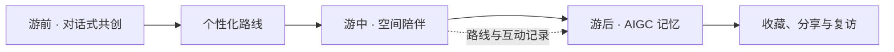

# 奇遇长隆 · 全周期空间智能动物 Agent 游园系统

> 从「查地图」到「有伙伴陪你玩」——面向主题乐园的 AI 原生全周期体验原型。

[在线体验](https://qiyucl.site) · [产品上下文](chimelong-pretrip-demo/PROJECT_CONTEXT.md) · [部署说明](chimelong-pretrip-demo/DEPLOY.md)

**奇遇长隆**是一套面向主题乐园的空间智能伴游方案。它将游前的个性化规划、游中的位置感知陪伴与游后的 AIGC 记忆创作串成一条连续体验：系统不只回答问题，而是结合游客画像、园区空间与实时情境，主动帮助游客做决定、抵达目的地并留存回忆。

> 本项目为参赛概念原型，与长隆集团无官方隶属关系。相关名称、商标与品牌资产归各自权利人所有。

## 体验闭环



| 阶段 | 用户体验 | 系统能力 |
| --- | --- | --- |
| 游前 | 与动物伙伴对话，确定同行结构、时间、节奏、兴趣和餐饮偏好 | 多角色 Agent、约束收集、距离知识图谱与路径编排 |
| 游中 | 在展区遇见对应伙伴，获得科普、观察任务、服务导航与行程调整 | 地图/GIS 模拟、地理围栏触发、动态路线与服务点导航 |
| 游后 | 把轨迹、对话、照片和任务变成可收藏的旅行内容 | 回忆星册、奇遇票根、AI bit 风纪念照与票根册 |

## 核心亮点

- **双层 Agent 设计**：全局调度负责路线与取舍；熊猫、白虎、考拉、大象、长颈鹿、猩猩等角色以独立人设完成情感化陪伴。
- **空间即交互界面**：通过园区地图、展区坐标与地理围栏模拟“走到哪里，谁来陪你”的沉浸式体验。
- **可解释的个性化路线**：综合兴趣优先级、同行结构、游玩节奏、停留时长、餐饮与步行距离，输出时间轴、地图和未安排原因。
- **从体验到记忆资产**：将真实游玩记录沉淀为回忆星册、电子票根与 AI 图像创作，探索内容传播与 IP 衍生的自然连接。
- **面向真实落地的边界意识**：Demo 以模拟客流和本地存储承载评审体验；生产环境需接入官方 GIS、实时运营数据、用户授权与隐私治理体系。

## 技术架构

```text
Nuxt 4 + Vue 3 + TypeScript
        │
        ├── 游前：角色化对话 / 路线规划 / 园区距离数据
        ├── 游中：地图交互 / 空间触发 / 服务导航
        ├── 游后：回忆内容 / 票根编辑 / 图片风格转换
        │
Nitro Server APIs ── OpenAI-compatible Chat & Image APIs
        │
Nginx + PM2 · 线上部署
```

## 仓库结构

```text
├── chimelong-pretrip-demo/    # 可运行的 Nuxt 全栈体验原型
├── qiyu-remotion-video/       # React + Remotion 宣传片工程
├── 补充材料/                  # 系统逻辑与体验说明材料
├── 宣传图/                    # 项目视觉资产
└── *.xmind / *.opml           # 全周期体验架构源文件
```

## 快速开始

环境要求：Node.js 20+、pnpm 9+。

```bash
git clone https://github.com/2695943032-tech/-agent-in-changlong.git chimelong-agent
cd chimelong-agent/chimelong-pretrip-demo
pnpm install
pnpm dev
```

访问 `http://localhost:3000`。未配置 AI 服务时，应用会回退到本地模板，不影响主要体验流程。

如需启用模型能力，请复制 `chimelong-pretrip-demo/.env.example` 为 `.env`，仅在本地填写服务端配置。请勿提交 `.env`、访问令牌或任何真实凭据。

```bash
pnpm typecheck
pnpm test
pnpm build
```

## 宣传片工程

```bash
cd qiyu-remotion-video
pnpm install
pnpm studio
```

使用 `pnpm render` 输出宣传片。录屏和第三方服务配置仅应保存在本地环境变量中。

## 隐私、数据与使用边界

- 当前原型使用浏览器本地存储模拟游客画像、轨迹、互动记录与媒体资产。
- 定位、照片、声音与未成年人相关能力在真实产品中需遵循明确授权、最小化采集、可撤回和删除机制。
- 仓库不包含真实 API Key、私钥、访问令牌或生产环境凭据；如发现意外提交，请立即吊销并替换相关凭据。

## License

本仓库用于作品展示与技术交流。涉及第三方名称、商标、图片与素材的权利归其各自权利人所有；未经授权，请勿将其用于商业推广或暗示合作关系。
